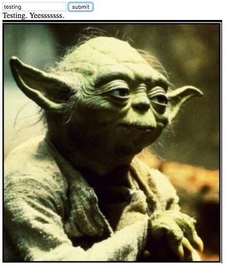

# YODA FEELS

In the input box, add a string of text. Convert text to yoda speak, and also get an image corresponding to the analyzed sentiment of the text.
This is an example of API usage.

## To use:

```
git clone https://github.com/sarapple/yodafeels
bower install
```

Add a key.js file to root of the project, and set the following variable:

```
var MASHAPE_KEY = "somekeyhash";
```

